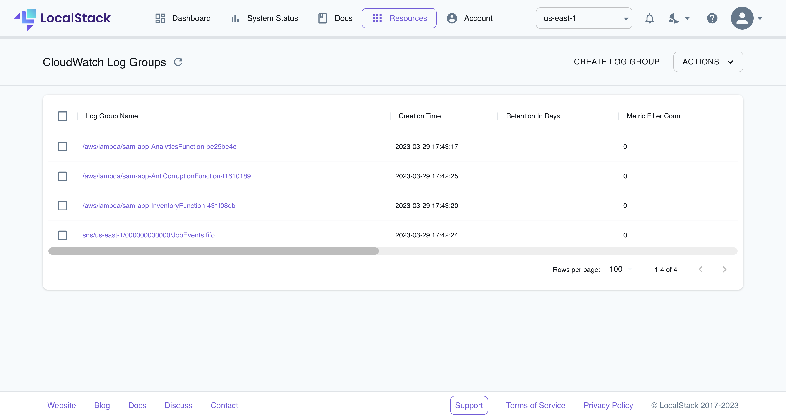

# Event-driven architecture with Amazon SNS FIFO, DynamoDB, Lambda, and S3

| Key          | Value                                                                                           |
| ------------ | ----------------------------------------------------------------------------------------------- |
| Environment  | LocalStack                                                                                      |
| Services     | SNS, DynamoDB, Lambda, S3                                                                       |
| Integrations | SAM                                                                                             |
| Categories   | Serverless; Event-driven architecture                                                           |
| Level        | Intermediate                                                                                    |
| GitHub       | [Repository link](https://github.com/localstack/event-driven-architecture-with-amazon-sns-fifo) |

 ## Introduction

The Event-driven architecture with Amazon SNS FIFO, DynamoDB, Lambda, and S3 sample demonstrates a recruiting agency application with a job listings website. The sample application implements three services:

- An anti-corruption service that receives a change data capture (CDC) event stream of changes, translated into meaningful events that are then sent to the SNS FIFO `JobEvents.fifo` topic. The interested services subscribe to these events and process them asynchronously.
- An analytics service with an SQS FIFO `AnalyticsJobEvents.fifo` queue subscribed to the SNS FIFO `JobEvents.fifo` topic. SQS FIFO is an event source for Lambda functions, with events stored in an S3 bucket for persistence.
- An inventory service with an SQS FIFO `InventoryJobEvents.fifo` queue subscribed to the SNS FIFO `JobEvents.fifo` topic. It tracks `JobCreated` and `JobDeleted` events and the data is stored inside a DynamoDB table with the help of the SNS filter policy.

Users can deploy this application on LocalStack and AWS with minimal changes to the Lambda functions using Serverless Application Model. To test this application sample, we will demonstrate how you use LocalStack to deploy the infrastructure on your developer machine and your CI environment. Furthermore, we will showcase how you can check out the event-driven architecture using LocalStack Web Application by verifying the logs.

## Architecture diagram

The following diagram shows the architecture that this sample application builds and deploys:


We are using the following AWS services and their features to build our infrastructure:

- [SNS](https://docs.localstack.cloud/user-guide/aws/sns/) to coordinate the delivery of messages to subscribing clients in the Analytics and the Inventory service by setting a FIFO topic to process events in an ordered manner
- [SQS](https://docs.localstack.cloud/user-guide/aws/sqs/) as a distributed message queuing service to implement a FIFO queue which is subscribed to the SNS FIFO topic and acts as an event source for Lambda, 
- [DynamoDB](https://docs.localstack.cloud/user-guide/aws/dynamodb/) as a key-value and document database to persist the available job listings from the Inventory service.
- [Lambda](https://docs.localstack.cloud/user-guide/aws/lambda/) to create the serverless functions to send job events with business meaning, consume the SQS events in batches and persist the data in S3 buckets.
- [S3](https://docs.localstack.cloud/user-guide/aws/s3/) to store the analytics for the job events for long-term persistence.

## Prerequisites

- LocalStack Pro with the [`localstack` CLI](https://docs.localstack.cloud/getting-started/installation/#localstack-cli).
- [Serverless Application Model](https://docs.localstack.cloud/user-guide/integrations/aws-sam/) with the [`samlocal`](https://github.com/localstack/aws-sam-cli-local) installed.
- [AWS CLI](https://docs.localstack.cloud/user-guide/integrations/aws-cli/) with the [`awslocal` wrapper](https://docs.localstack.cloud/user-guide/integrations/aws-cli/#localstack-aws-cli-awslocal).
- [Python 3.9.0](https://www.python.org/downloads/release/python-390/) in the `PATH`

Start LocalStack Pro with the `LOCALSTACK_API_KEY` pre-configured:

```shell
export LOCALSTACK_API_KEY=<your-api-key>
DEBUG=1 localstack start
```

We specified DEBUG=1 to get the printed LocalStack logs directly in the terminal to help us see the event-driven architecture in action. If you prefer running LocalStack in detached mode, you can add the `-d` flag to the `localstack start` command, and use Docker Desktop to view the logs.

## Instructions

You can build and deploy the sample application on LocalStack by running our `Makefile` commands: `build` and `deploy`. Alternatively, here are instructions to deploy it manually step-by-step.

### Building the application

To build the SAM application, run the following command:

```shell
samlocal build
```

If you see a `Build Succeeded` message, you can proceed to the next step.

> If the SAM application build fails, you can check if you have the Python 3.9 installed and in the `PATH`. Alternatively, use [`pyenv`](https://github.com/pyenv/pyenv) to switch between multiple versions of Python.

### Deploying the application

To deploy the SAM application, run the following command:

```shell
samlocal deploy --resolve-s3
```

The above command will create a new managed S3 bucket to store the artifacts of the SAM application. If you want to use an existing S3 bucket, you can use the `--s3-bucket` flag to specify the bucket name. Before being deployed, the CloudFormation changeset will be displayed in the terminal. If you want to deploy the application without confirmation, you can use the `--no-confirm-changeset` flag.

To view the created resources, check out the CloudFormation outputs from deployed stack or run the following commands

```shell
awslocal sqs list-queues
awslocal sns list-topics
awslocal dynamodb list-tables
awslocal lambda list-functions
awslocal s3 ls
```

### Testing the application

After a successful deployment, you can test the application's functionality by checking out the LocalStack logs (`localstack logs`). For more verbose logs, we have enabled `DEBUG=1`, and you can alternatively set `LS_LOG=trace-internal` to see internal calls between different services.

We offer **Resource Browsers** in the LocalStack Web Application to help you visualize the resources created by the application. You can access the Web Application by visiting [**app.localstack.cloud**](https://app.localstack.cloud) in your browser. Navigate to the [CloudWatch Log Groups](https://app.localstack.cloud/resources/cloudwatch/groups) to verify the Log groups.



You can click on the individual Log groups to view the logs. You can also apply custom filters to the logs, or navigate to the Resource Browsers for other AWS services to view the resources created by the sample application.

### GitHub Action

This application sample hosts an example GitHub Action workflow that starts up LocalStack, builds the Lambda functions, and deploys the infrastructure on the runner. You can find the workflow in the  `.github/workflows/main.yml`  file. To run the workflow, you can fork this repository and push a commit to the  `main`  branch.

Users can adapt this example workflow to run in their own CI environment. LocalStack supports various CI environments, including GitHub Actions, CircleCI, Jenkins, Travis CI, and more. You can find more information about the CI integration in the  [LocalStack documentation](https://docs.localstack.cloud/user-guide/ci/).

## Learn more

The sample application is based on a public [AWS sample app](https://github.com/aws-samples/event-driven-architecture-with-amazon-sns-fifo) that deploys an event-driven architectures with Amazon SNS FIFO. See this AWS blog post for more details: [Building event-driven architectures with Amazon SNS FIFO
](https://aws.amazon.com/blogs/compute/building-event-driven-architectures-with-amazon-sns-fifo/).

## Contributing

We appreciate your interest in contributing to our project and are always looking for new ways to improve the developer experience. We welcome feedback, bug reports, and even feature ideas from the community.
Please refer to the [contributing file](CONTRIBUTING.md) for more details on how to get started. 

